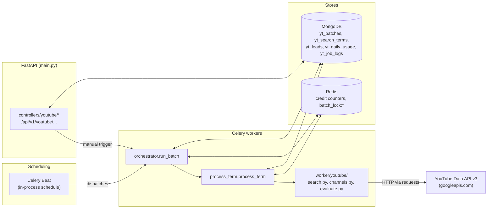

# YouTube API Backend — Architecture Documentation

> Source of truth: this document describes only what is verifiable in the repository at commit `9febe42` (branch `feat/youtube-batch-auto-scheduler`). Anything that could not be confirmed from code, config, or tests is explicitly marked **Not verified**.

---

## 1. Executive Summary

The backend runs a daily, fully automated YouTube lead-generation pipeline. An operator creates a **batch** — a name, an ordered list of search terms, and a set of qualification filters. Once queued, two Celery Beat schedules take over: one fires daily to start the first batch of the day, the other polls every two minutes to advance the queue. For each search term, the system searches YouTube for matching videos, harvests the uploading channels, pulls full channel metadata, and runs each channel through a qualification gate (subscriber range, country, upload cadence, average views). Channels that pass are written to MongoDB as **leads**. Everything is sequential — one batch a day, one term at a time, one channel at a time — and is budgeted against a daily YouTube Data API credit quota shared across up to two API keys.

## 2. Scope and Purpose

This document covers the backend implementation under `backend-app/app/{worker,repositories,schemas,controllers,core}/youtube*` and the Celery scheduling wired in `backend-app/app/celery_app.py`. It does not cover the frontend UI in depth, authentication/user management, or unrelated features (thumbnail generation, hooks analyzer) beyond noting where they share infrastructure.

## 3. Technology Stack

Verified from `backend-app/pyproject.toml` and direct imports:

| Layer | Technology |
|---|---|
| API framework | FastAPI 0.115 (`backend-app/main.py`) |
| Background jobs | Celery 5.6 — Redis as both broker and result backend (`app/celery_app.py`) |
| Scheduling | Celery Beat, in-process `beat_schedule` (`app/celery_app.py:26-37`) |
| Primary data store (YouTube feature) | MongoDB, via `pymongo` (sync) — `app/mongo/*` |
| Quota / locking store | Redis, via `redis-py` (`app/cache/redis_client.py`, `app/worker/youtube/credits.py`) |
| Other data store | PostgreSQL via SQLAlchemy/asyncpg (used by auth/users — **not** used by the YouTube feature) |
| YouTube API client | Hand-rolled HTTP via the `requests` library, calling `https://www.googleapis.com/youtube/v3` directly with an API key query parameter — **not** the `google-api-python-client` SDK, even though that package is an installed dependency (it is used elsewhere, e.g. `app/utils/google_utils/google_sheet.py`, for unrelated Google Sheets integration — Not verified in further detail, out of scope) |
| Frontend | React + TypeScript, generated OpenAPI client (`frontend/src/client/*`, header: "generated using openapi-typescript-codegen") |

## 4. Repository Structure

```
backend-app/
  app/
    celery_app.py                  Celery app + beat_schedule (the only schedule definitions)
    core/
      config.py                    YOUTUBE_API_KEY_V3, YOUTUBE_API_KEY_V3_2, YOUTUBE_DAILY_CREDIT_LIMIT
      youtube_keys.py               Ordered API key resolution (primary + optional secondary)
      youtube_countries.py          Country allowlist + normalization (added by this change, see RCA doc)
    controllers/youtube/
      batches.py                    Batch CRUD, trigger, finalize, term reset-to-pending
      leads.py                      Paginated leads, CSV export
      credits.py                    Today's credit usage
    repositories/youtube/
      batch_repo.py, search_term_repo.py, job_log_repo.py, lead_repo.py, daily_usage_repo.py
    schemas/youtube/
      batch.py, search_term.py, lead.py, job_log.py
    worker/
      scheduler.py                  Celery Beat tasks: auto_trigger_daily, auto_trigger_worker
      orchestrator.py               run_batch — the batch state machine
      process_term.py               process_term — one search term end-to-end
      youtube/
        search.py                  collect_channel_ids — YouTube Search API paging
        channels.py                 channel/playlist/video detail fetches
        evaluate.py                 evaluate_channel — the qualification gate (incl. country filter)
        credits.py, quota_context.py  Redis-backed multi-key credit tracking
  tests/
    test_youtube_batch_finalize.py, test_youtube_orchestrator_finalise.py, test_youtube_quota_context.py
    test_youtube_country_filter.py  Added by this change
  scripts/
    audit_youtube_lead_countries.py  Added by this change (read-only Mongo audit)
tickets/youtube-backend/youtube_script.py   Original single-file script this system was ported from
frontend/src/
  pages/youtube-script/            Batch list/detail/create UI
  hooks/api/useYoutubeApi.ts
  client/services/Youtube{Batches,Leads,Credits}Service.ts   Generated API client
docs/                               This document, the RCA, and the implementation report
```

## 5. High-Level Architecture



FastAPI and the Celery worker/beat processes are separate runtimes (see `docker-compose.yml`: `celery-worker` and `celery-beat` are distinct containers) that share MongoDB and Redis. The API layer never talks to the YouTube API directly — it only reads/writes Mongo and enqueues `run_batch`.

## 6. Daily Scraping Workflow

Two Celery Beat entries, defined in `app/celery_app.py:26-37`:

| Task | Schedule | Defined in |
|---|---|---|
| `youtube.auto_trigger_daily` | `crontab(hour=7, minute=30)` — once daily at 07:30 UTC | `app/worker/scheduler.py:96-110` |
| `youtube.auto_trigger_worker` | `crontab(minute="*/2")` — every 2 minutes | `app/worker/scheduler.py:113-137` |

`auto_trigger_daily` finds the oldest `QUEUED`/`PAUSED` batch (`batch_repo.list_eligible_for_trigger()`, sorted `createdAt` ascending) and dispatches it with `run_batch.delay(batch_id)`, but only if `_credits_available()` — today's cumulative `creditsUsed` is below `YOUTUBE_DAILY_CREDIT_LIMIT × n_keys`.

`auto_trigger_worker` runs continuously and is what actually keeps the day moving: it checks credits are available, checks `yt_daily_usage.activeBatchId` is not set (no batch currently running), and if both hold, dispatches the next oldest eligible batch. It is a no-op — by design — most of the time.

Both tasks funnel into the same `run_batch.delay(batch_id)` call used by the manual "Trigger" button (`POST /batches/{id}/trigger`, `app/controllers/youtube/batches.py:197-214`) — there is one dispatch path regardless of who/what initiated it.

**One-batch-per-day enforcement**, two layers:
1. `yt_daily_usage.activeBatchId` (Mongo) — set at run start (`daily_usage_repo.set_active_batch`), cleared at run end (`clear_active_batch`); both scheduler tasks and the manual trigger endpoint check it before dispatching.
2. `batch_lock:{batch_id}` (Redis, `SET NX EX 600`) — acquired at the top of `run_batch` (`app/worker/orchestrator.py:52`), released in a `finally` block, so a worker crash cannot leave a batch permanently locked.

### 6.1 Daily Scraping Flow Diagram

This is the detailed execution path from scheduler trigger to database write, including the decision branches that actually exist in the code today. Nodes and branches not present in the codebase (e.g. automatic retry of a failed term) are intentionally omitted rather than implied; where a gap is worth flagging, it is called out in a note instead of drawn as a real path.

```mermaid
flowchart TD
    Start(["Celery Beat: 07:30 UTC daily\nOR every 2 min poll"]) --> CreditCheck{"Credits available\ntoday, all keys?"}
    CreditCheck -- "no" --> StopNoCredit(["Skip this cycle"])
    CreditCheck -- "yes" --> ActiveCheck{"A batch already\nactive today?"}
    ActiveCheck -- "yes" --> StopActive(["Skip — wait for it\nto finish"])
    ActiveCheck -- "no" --> Select["Select oldest QUEUED\nor PAUSED batch"]
    Select --> NoneFound{"Any eligible\nbatch found?"}
    NoneFound -- "no" --> StopEmpty(["Skip — queue empty"])
    NoneFound -- "yes" --> Dispatch["run_batch.delay(batch_id)"]

    Dispatch --> Lock{"Redis lock\nbatch_lock:{id}\nacquired?"}
    Lock -- "no (already running)" --> StopLock(["Return — duplicate\ntrigger rejected"])
    Lock -- "yes" --> SeedQuota["Seed per-key Redis credit\ncounters from yt_daily_usage"]
    SeedQuota --> AllExhausted{"All keys already\nat daily limit?"}
    AllExhausted -- "yes" --> PauseNoTerm["Batch -> PAUSED\n(no term attempted)"]
    AllExhausted -- "no" --> MarkRunning["Batch -> RUNNING\nyt_daily_usage.activeBatchId = batch"]

    MarkRunning --> GetTerms["Fetch pending search terms\n(status=pending, order by position)"]
    GetTerms --> AnyPending{"Any pending\nterms?"}
    AnyPending -- "no" --> Finalise

    AnyPending -- "yes" --> TermLoop["Take next term\n(sequential, in position order)"]
    TermLoop --> TermQuotaCheck{"All keys exhausted\nbefore this term?"}
    TermQuotaCheck -- "yes" --> PauseMidRun["Batch -> PAUSED\nremaining terms stay pending"]
    TermQuotaCheck -- "no" --> MarkTermRunning["Term -> running"]

    MarkTermRunning --> Search["YouTube search.list\n(paged, order=relevance)"]
    Search --> SearchErr{"Request failed /\nmalformed response?"}
    SearchErr -- "yes" --> LogWarnSkip["Log warning,\ntreat page as empty,\nstop paging this order"]
    SearchErr -- "no" --> Extract["Extract + de-dupe\nchannelId per video hit"]
    Extract --> EmptyPage{"Zero items\non this page?"}
    EmptyPage -- "yes" --> NextPageCheck
    EmptyPage -- "no" --> YieldCheck{"3 consecutive pages\nwith <5 new channels?"}
    YieldCheck -- "yes" --> PoolDone["Stop paging —\nlow yield"]
    YieldCheck -- "no" --> PoolCheck{"Pool >= 500\nchannels?"}
    PoolCheck -- "yes" --> PoolDone
    PoolCheck -- "no" --> NextPageCheck{"nextPageToken\npresent?"}
    NextPageCheck -- "yes" --> Search
    NextPageCheck -- "no" --> PoolDone
    LogWarnSkip --> PoolDone

    PoolDone --> ChannelFetch["channels.list, batches of 50\n(statistics, contentDetails, snippet)"]
    ChannelFetch --> ChannelErr{"Batch request\nfailed?"}
    ChannelErr -- "yes" --> LogWarnSkipBatch["Log warning,\nskip this batch of 50,\ncontinue with next batch"]
    ChannelErr -- "no" --> EvalLoop["Evaluate each channel\n(sequential)"]
    LogWarnSkipBatch --> MoreBatches{"More ID\nbatches?"}
    MoreBatches -- "yes" --> ChannelFetch
    MoreBatches -- "no" --> InsertLeads

    EvalLoop --> SubsCheck{"Subscriber count\nin range?"}
    SubsCheck -- "no" --> Rejected["Channel rejected\n(discarded, not stored)"]
    SubsCheck -- "yes" --> CountryCheck{"Country in\nallowlist?\n(US/GB/NZ/AU/AE/SG/CA)"}
    CountryCheck -- "no / missing / unrecognized" --> Rejected
    CountryCheck -- "yes" --> ExcludeCheck{"In batch's\nexcludeCountries?"}
    ExcludeCheck -- "yes" --> Rejected
    ExcludeCheck -- "no" --> VideoCountCheck{"videoCount >= 20?"}
    VideoCountCheck -- "no" --> Rejected
    VideoCountCheck -- "yes" --> PlaylistCheck{"Has uploads\nplaylist?"}
    PlaylistCheck -- "no" --> Rejected
    PlaylistCheck -- "yes" --> CadenceCheck{"Recent uploads\n>= minUploadsLast30d?"}
    CadenceCheck -- "no" --> Rejected
    CadenceCheck -- "yes" --> ViewsCheck{"Avg views\n>= minAvgViews?"}
    ViewsCheck -- "no" --> Rejected
    ViewsCheck -- "yes" --> Qualify["Score + extract email\n-> qualified lead"]

    Rejected --> MoreChannels{"More channels\nto evaluate?"}
    Qualify --> MoreChannels
    MoreChannels -- "yes" --> EvalLoop
    MoreChannels -- "no" --> InsertLeads["insert_many() qualified leads\n(atomic — all or none)"]

    InsertLeads --> TermException{"Unhandled exception\nanywhere in this term?"}
    TermException -- "CreditLimitExceeded" --> RollbackTerm["Term -> pending (rolled back)\nBatch -> PAUSED\nremaining terms stay pending"]
    TermException -- "other exception" --> MarkFailed["Term -> failed\nerror logged to yt_job_logs\n(no automatic retry)"]
    TermException -- "no" --> MarkDone["Term -> done\nstats recorded"]

    MarkFailed --> MoreTerms
    MarkDone --> MoreTerms{"More pending\nterms?"}
    MoreTerms -- "yes, credits remain" --> TermLoop
    MoreTerms -- "no" --> Finalise["Finalise batch"]

    Finalise --> AnyIncomplete{"Any term still\npending/running?"}
    AnyIncomplete -- "yes" --> BatchPaused["Batch -> PAUSED\n(picked up again next\nscheduler cycle)"]
    AnyIncomplete -- "no" --> AllDone{"All terms done?"}
    AllDone -- "yes" --> BatchCompleted["Batch -> COMPLETED"]
    AllDone -- "no (mix incl. failed)" --> BatchCompletedWithFailures["Batch -> COMPLETED\n(with failed terms visible in logs)"]

    RollbackTerm --> ReleaseLock["Redis lock released\n(finally block)"]
    PauseMidRun --> ReleaseLock
    PauseNoTerm --> ReleaseLock
    BatchPaused --> ReleaseLock
    BatchCompleted --> ReleaseLock
    BatchCompletedWithFailures --> ReleaseLock

    style CountryCheck fill:#dcece9,stroke:#0e7a72
    style ExcludeCheck fill:#dcece9,stroke:#0e7a72
```



**Reading the branches:**
- **Batch pause/resume** — a `PAUSED` batch is not a dead end: `list_eligible_for_trigger()` returns `QUEUED` *and* `PAUSED` batches, so the next scheduler cycle (or a manual trigger) re-dispatches it, and `get_pending_for_batch()` only returns terms still `pending` — completed terms are never redone.
- **Retry behavior** — the diagram intentionally shows *no* loop-back arrow from `MarkFailed`. There is none in the code (Section 14). A failed term is permanent until a human calls the reset-to-pending endpoint.
- **Quota exhaustion** — has two entry points: proactively (`TermQuotaCheck`, before spending anything on a new term) and reactively (`TermException = CreditLimitExceeded`, mid-term). Both lead to the same `PAUSED` outcome.
- **Empty search results / invalid metadata** — modeled as `EmptyPage` and `ChannelErr`/`SearchErr`; none of these abort the term, they just mean fewer or zero channels move forward from that step.

## 7. Search-Term Processing

A batch holds an ordered list of `SearchTermDocument`s (`app/schemas/youtube/search_term.py`), each with a `position` and a `status` (`pending` / `running` / `done` / `failed`).

`orchestrator._run()` (`app/worker/orchestrator.py:144-190`) fetches `search_term_repo.get_pending_for_batch(batch_id)` (query: `status == "pending"`, sorted by `position`) and iterates it with a plain Python `for` loop, calling `process_term(batch_id, term_id, today)` **inline, synchronously** — not `process_term.delay(...)`. The docstring is explicit about why: *"Run term processing inline to guarantee exception propagation. Using Celery's `Task.apply()` can return a failure result without raising, which breaks the credit-limit pause/rollback behavior."*

**Processing is sequential — not concurrent — at every level of the pipeline:**
- Batches: one active batch system-wide per day.
- Terms within a batch: one at a time, in `position` order; term *N+1* is not started until term *N* finishes.
- Search pages within a term: one HTTP request at a time (`time.sleep(0.2)` between pages, `app/worker/youtube/search.py:99`).
- Channel-detail batches: one `channels.list` call at a time (`time.sleep(0.2)`, `app/worker/youtube/channels.py:55`).
- Per-channel evaluation: a plain `for` loop (`app/worker/process_term.py:93-102`), no threading or asyncio.

There is no `celery.group`, `chord`, `asyncio.gather`, or thread pool anywhere in this pipeline (**Not verified**: an exhaustive repo-wide search for concurrency primitives was not re-run for this section beyond the files read directly, but none were found in `orchestrator.py`, `process_term.py`, `search.py`, `channels.py`, or `evaluate.py`).

**When one term fails:** `process_term()` catches any non-`CreditLimitExceeded` exception, calls `search_term_repo.mark_failed(term_id, error_message)`, logs a `term_failed` event to `yt_job_logs`, and re-raises (`app/worker/process_term.py:152-157`). The orchestrator's loop catches that re-raised exception, logs it, and **does not break** — the `for` loop continues to the next pending term (`app/worker/orchestrator.py:180-184`, comment: *"Mark is already done by process_term; continue to next term"*).

## 8. YouTube API Integration

All calls hit `https://www.googleapis.com/youtube/v3` directly via `requests.get(...)` with a 15-second timeout and the API key as a query parameter (`key=...`). Three endpoints are used:

| Endpoint | Called from | Purpose | Cost |
|---|---|---|---|
| `search.list` | `search.py:65` | Find videos matching a term; harvest `channelId` | 100 credits/call |
| `channels.list` | `channels.py:48` | Full channel `statistics`, `contentDetails`, `snippet` (batches of 50 IDs) | 1 credit/call |
| `playlistItems.list` | `channels.py:78` (`get_recent_videos`) | Recent uploads for a channel's uploads playlist | 1 credit/call |
| `videos.list` | `channels.py:105` (`get_video_stats`) | View counts for up to 20 recent videos | 1 credit/call |

Every request goes through `YouTubeQuotaContext.prepare_for_charge(cost)` (`app/worker/youtube/quota_context.py:45-70`) first, which returns `(api_key, counter)` for whichever configured key has room, or raises `CreditLimitExceeded` if none do.

## 9. Channel Discovery and Metadata Retrieval

`collect_channel_ids()` (`app/worker/youtube/search.py:26-109`) does not search for channels directly — YouTube's `search.list` with `type=video` returns videos; the function extracts and de-duplicates the `channelId` of each result's uploader. It pages up to `MAX_SEARCH_PAGES = 60` pages of 50 results, stopping early on either signal:
- **Low yield:** 3 consecutive pages that each add fewer than 5 new channel IDs.
- **Pool cap:** once 500 unique channel IDs have been collected (`TARGET_CHANNEL_POOL`).

`SEARCH_ORDERS = ["relevance"]` (`search.py:17`) is a single-element list, iterated by an outer `for order in SEARCH_ORDERS` loop that therefore only ever runs once. The module docstring still says discovery searches "across 3 sort orders" — **this is stale**; only one sort pass currently executes. (Flagged in Section 16.)

Pagination itself is standard `nextPageToken` chaining (`search.py:61-62, 95-97`) — stops when the API returns no `nextPageToken` or a stop condition above is hit.

Channel IDs are then resolved to full metadata via `get_channel_details_batch()` (`channels.py:28-58`), which chunks the ID list into batches of 50 (YouTube's per-request cap for `channels.list`) and requests `part=statistics,contentDetails,snippet`.

## 10. Country Filtering and Other Qualification Filters

`evaluate_channel()` (`app/worker/youtube/evaluate.py:34-153`) runs six checks per channel, in order, short-circuiting on the first failure:

1. `minSubs ≤ subscriberCount ≤ maxSubs` (batch filter)
2. **Country allowlist** — as of this change, `is_allowed_country(channel.snippet.country)` (see `docs/youtube-country-filter-rca.md` for the full history and fix); previously an `excludeCountries` denylist defaulting to `["IN"]`
3. `videoCount ≥ 20` — **hardcoded**, not exposed as a configurable filter anywhere
4. Channel has an uploads playlist at all (sanity check)
5. Upload cadence: uploads in the last 30 days ≥ `minUploadsLast30d` (from up to 15 recent uploads via `playlistItems.list`)
6. Average views: mean view count of up to 20 recent videos ≥ `minAvgViews`

A channel that clears all six gets a relevance score (`score = uploadsLast30d×3 + log10(subs+1)×2 + avgViews/10,000`, `evaluate.py:128-132`) and an email extracted from its description via regex, with a fallback `captcha` status if "business"/"contact" appears in the description without a matched email (`evaluate.py:115-126`).

## 11. Database Schema and Data Flow

Five MongoDB collections, all prefixed `yt_`:

| Collection | Schema | Key fields |
|---|---|---|
| `yt_batches` | `app/schemas/youtube/batch.py` | `status` (queued/running/paused/completed/finalized/failed), `filters` (`BatchFilters`), `totalTerms`/`processedTerms` |
| `yt_search_terms` | `app/schemas/youtube/search_term.py` | `status` (pending/running/done/failed), `position`, per-term stats (`creditsUsed`, `channelsDiscovered`, `channelsQualified`, `emailsFound`) |
| `yt_leads` | `app/schemas/youtube/lead.py` | `batchId`, `searchTermId`, `channelId`, `country`, `score`, `email`, `emailStatus` |
| `yt_daily_usage` | (no Pydantic model; plain dicts in `daily_usage_repo.py`) | one document per Pacific-time date: `creditsUsed`, `creditsByKey`, `activeBatchId`, `runsCompleted` |
| `yt_job_logs` | `app/schemas/youtube/job_log.py` | append-only event log per batch (and optionally per term) |

Data flow per term: `process_term()` accumulates qualified leads in a Python list in memory, then writes them with a single `lead_repo.insert_many()` call at the end of the term (`process_term.py:107`) — a term either commits all its leads or, on a crash before that point, commits none (no partial per-channel writes within a term).

There is **one** `yt_leads` document per `(batchId, channelId)` discovery event — leads are not deduplicated globally across batches, only within a batch, and only on manual finalize (Section 15).

## 12. Background Jobs, Scheduling, and Queues

Celery, with Redis as both broker and result backend (`app/celery_app.py:8-18`). Four task names are registered across the codebase: `youtube.run_batch`, `youtube.process_term`, `youtube.auto_trigger_daily`, `youtube.auto_trigger_worker` (plus an unrelated `app.worker.thumbnail.generate` module included in the same Celery app). No custom queues/routing are configured — all tasks share the default queue (**Not verified**: no `task_routes` config was found in `celery_app.py`, but a dedicated queue config elsewhere was not exhaustively ruled out).

`docker-compose.yml` runs the worker and beat scheduler as separate containers (`celery-worker`, `celery-beat`), both depending on healthy `postgres`, `mongo`, and `redis` services. A `flower` container (port 5555) is included for task monitoring.

## 13. API Quota Management

Covered in depth in the earlier session's "Quota & key failover" material; summarized here:

- Up to two API keys: `YOUTUBE_API_KEY_V3` (required) and `YOUTUBE_API_KEY_V3_2` (optional) — `app/core/youtube_keys.py:10-31`.
- Per-key daily limit: `YOUTUBE_DAILY_CREDIT_LIMIT`, default `10000` (`app/core/config.py:53`).
- Redis counters `yt_credits:{date}:k{index}`, date keyed to Pacific time, seeded from the persisted Mongo value (`yt_daily_usage.creditsByKey`) at the start of every `run_batch` (`quota_context.py:84-94`) and written back after every term (`orchestrator.py:186-190`).
- `YouTubeQuotaContext.prepare_for_charge()` (`quota_context.py:45-70`) charges the current key if it has room, else advances to the next key; if the last key also lacks room, it raises `CreditLimitExceeded`.
- **On quota exhaustion mid-term:** `process_term()` catches `CreditLimitExceeded`, rolls the in-progress term back to `pending` (`search_term_repo.reset_to_pending`), logs `term_paused_quota`, and re-raises (`process_term.py:139-150`). The orchestrator catches that, rolls the term back again (idempotent), marks the batch `PAUSED`, clears `activeBatchId`, and stops the term loop (`orchestrator.py:171-179, 192-205`). The batch resumes automatically the next time a scheduler cycle finds it eligible (its rolled-back term is `pending` again, so it re-runs from that exact term).
- **Proactive check:** before even attempting a term, the orchestrator checks `all_keys_exhausted()` and pauses the batch without spending a request if the budget is already gone (`orchestrator.py:157-164`).

## 14. Error Handling and Retry Logic

**There is no Celery-level automatic retry** anywhere in this pipeline — none of `run_batch`, `process_term`, `auto_trigger_daily`, or `auto_trigger_worker` are decorated with `autoretry_for`, `max_retries`, or call `self.retry(...)`. Recovery is handled entirely at the application level:

| Failure | Behavior |
|---|---|
| One search term throws (network error, bad data, etc.) | Term marked `failed`, error logged, **batch continues to the next term** (Section 7) |
| Credit quota exhausted mid-term | Term rolled back to `pending`, batch paused, **resumes automatically** next eligible scheduler cycle (Section 13) |
| A term is stuck `running` (e.g. worker process crashed/was killed mid-term) | **No automatic recovery.** Requires a human to call `POST /batches/{id}/terms/{term_id}/reset-to-pending` (`batches.py:240-311`), which deletes any leads that term already wrote, resets it to `pending`, and re-queues the batch |
| A search/channels HTTP request itself fails (timeout, non-200, malformed JSON) | Caught locally with a `try/except` around the `requests.get(...)` call in `search.py`/`channels.py`, logged as a warning, and treated as zero results for that page/batch — the loop simply moves on (`search.py:64-68`, `channels.py:47-51, 77-81, 104-108`). **No retry of the individual HTTP call.** |
| Batch left with some terms still `pending`/`running` when the run loop exits (crash, timeout) | `_finalise()` refuses to mark the batch `completed` in this case — it forces `paused` instead (`orchestrator.py:224-226`), covered by `tests/test_youtube_orchestrator_finalise.py` |

## 15. Deduplication and Idempotency

**Deduplication** is a manual, batch-scoped step: `POST /batches/{id}/finalize` (requires every term `done` first) calls `lead_repo.deduplicate_for_batch()` (`lead_repo.py:58-91`), a Mongo aggregation that groups leads by `channelId` within the batch and deletes all but the highest-scoring document per channel. It is not automatic and does not run across batches — the same channel discovered by two different batches (or two different terms in the same batch, which is the common case) produces one surviving lead per batch, not globally.

**Idempotency:** within a term, leads are written with a single `insert_many()` at the end (Section 11), so a crash before that point leaves zero leads for the term (not a partial set). There is no upsert/idempotency key on `(batchId, channelId)` — re-running a term via the manual reset endpoint explicitly deletes that term's prior leads first (`lead_repo.delete_for_batch_term`, `batches.py:271`) specifically to prevent duplicates from a re-run; without that explicit delete, a naive re-run would create duplicate lead documents until the next `finalize` call cleaned them up.

## 16. Current Limitations

Verified directly from code, not speculative:

1. **Stale docstring / dead sort-order loop** — `search.py` claims 3 sort orders; only `relevance` runs (`SEARCH_ORDERS = ["relevance"]`).
2. **`videoCount ≥ 20` is hardcoded**, not part of `BatchFilters`, cannot be relaxed without a code change.
3. **No automatic retry** for stuck/crashed terms — requires manual intervention (Section 14).
4. **No queue-level concurrency** — the entire discovery→evaluation pipeline is strictly sequential (Section 7), which bounds daily throughput by wall-clock time as much as by credit budget.
5. **Deduplication is manual and batch-scoped**, not global or automatic.
6. **Country filtering** — see `docs/youtube-country-filter-rca.md` for the full analysis; summarized as an architectural finding here because it affects data quality broadly, not just this one filter: the batch-level filter UI (`YouTubeScriptTool.tsx`) never exposes `excludeCountries` for editing, so every batch created through the UI has always used whatever the hardcoded default is.
7. **`channels.snippet.country` is API-reported metadata, not verified creator residence** — see Section 17 and the RCA "Edge Cases" section for why this matters.

## 17. Technical Glossary

| Term | Meaning |
|---|---|
| Batch | A saved list of search terms + one shared set of qualification filters; the unit the scheduler queues and runs |
| Search term | One phrase within a batch, processed independently and sequentially |
| Lead | A channel that passed every check in `evaluate_channel()` for the term that discovered it |
| Credit | YouTube Data API's usage unit; `search.list` costs 100×, other calls used here cost 1 |
| Quota context | The per-run object selecting which API key to charge and failing over between them |
| Channel pool | The de-duplicated set of channel IDs a term's search phase discovers, before evaluation |
| Allowlist (this change) | The centralized, strict "only these countries" list replacing the prior denylist — see the RCA |
| `channels.snippet.country` | YouTube Data API field: an ISO 3166-1 alpha-2 code the channel owner optionally self-reports; not independently verified by YouTube, and may be absent |
