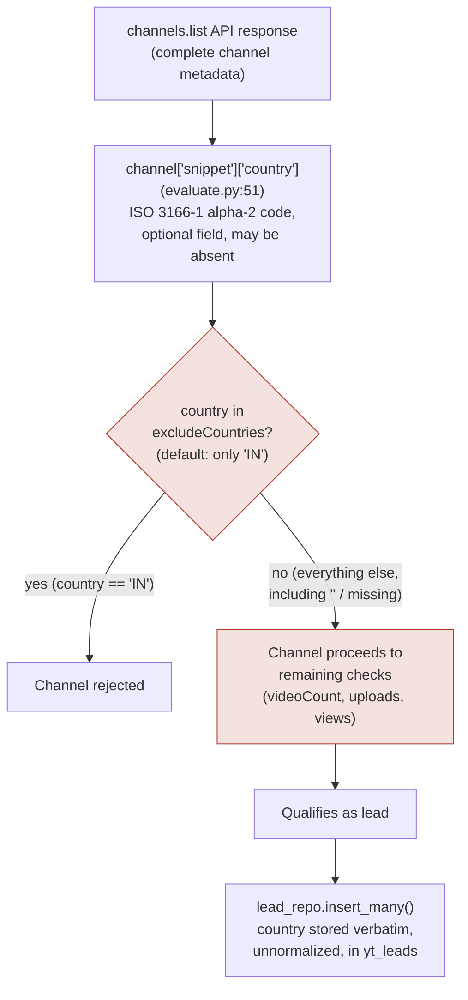

# YouTube Country Filter — Root Cause Analysis

> All findings below are traced to exact file paths and line numbers as of commit `9febe42` (branch `feat/youtube-batch-auto-scheduler`), before the fix in this change was applied. Reproduction evidence was generated by executing the actual repository code against synthetic (non-production) fixtures shaped like a real `channels.list` response — never fabricated production records. Anything not directly confirmed from the repository is marked **Not verified**.

## 1. Problem Statement

The business requires that generated lists of YouTube channels include only channels from seven countries: United States (US), United Kingdom (UK), New Zealand (NZ), Australia (AUS), United Arab Emirates (UAE), Singapore (SG), and Canada (CA). In practice, the current system does not reliably enforce this — channels from countries outside this list are being included in generated leads.

## 2. Expected Behavior

Only channels whose reported country matches one of the seven allowed countries should ever be eligible for qualified-lead creation. A channel with no country data, an unrecognized country, or a country outside the list should be rejected before it can be written to the database.

## 3. Actual Behavior

The only country-related check in the entire lead-creation pipeline is in `evaluate_channel()`, `backend-app/app/worker/youtube/evaluate.py`, lines 51–54 (pre-fix):

```python
country = channel.get("snippet", {}).get("country", "")
exclude_countries = filters.get("excludeCountries", ["IN"])
if country in exclude_countries:
    return None
```

This is a **denylist**, not an allowlist, and its default value excludes exactly one country: India (`"IN"`). Every other country on Earth — including all seven the business wants, but also every country the business does *not* want — passes this check. There is no code path anywhere in the repository that implements "only these seven countries." Confirmed by a repository-wide search: the string `country` (case-insensitive) appears in exactly three backend files — `evaluate.py` (the check above), `app/schemas/youtube/lead.py` (the field definition, for storage only), and `app/controllers/youtube/leads.py` (a CSV export column label only, no filtering logic).

## 4. Impact

- **Lead quality / geographic targeting:** every batch run today admits channels from any country worldwide (except India), directly defeating the seven-country targeting requirement. This is not an edge-case leak — it is the designed, default behavior for every batch.
- **UI compounds it:** the batch-creation form (`frontend/src/pages/youtube-script/YouTubeScriptTool.tsx`, lines 43–48) hardcodes `excludeCountries: ['IN']` in its initial state and exposes no input to change it. Grep of the same file for `country`/`excludeCountries` finds only that one hardcoded default — there is no form field. So the flaw is not just latent in the backend; it is the *only* behavior operationally reachable through the product UI. (An API client calling `POST /batches` directly could set a different `excludeCountries` list, since `BatchFiltersCreate` in `batches.py` accepts it — **Not verified** whether any such direct API usage exists in practice.)
- **Downstream workflows:** every exported lead list (`GET /batches/{id}/export`) and every lead shown in the UI inherits this — there is no later stage that re-filters by country before finalize/export.
- **Zero test coverage:** a repository-wide search of `backend-app/tests/` for `country` (case-insensitive) returns no matches. Nothing pinned the intended behavior, so this was never going to be caught by CI.

## 5. Current Country-Filtering Flow



Country data enters the system exactly once, from `channels.list` (full channel metadata — **not** from `search.list`, which only returns video snippets and does not include the channel's country; confirmed by comparing the fields requested in `search.py:52-59` (`part=snippet` on a video search — `snippet.channelId`, `snippet.channelTitle`, no country field exists on a video search result) against `channels.py:43` (`part=statistics,contentDetails,snippet` on `channels.list`, where `snippet.country` does exist)). Extraction and storage are correct; the defect is entirely in the comparison at node **C**.

## 6. Root Cause(s)

### RC1 — Denylist implemented where an allowlist is required (Confirmed)
- **File:** `backend-app/app/worker/youtube/evaluate.py`, lines 51–54 (pre-fix)
- **Function:** `evaluate_channel()`
- **What the code does:** rejects a channel only if its country is in `filters["excludeCountries"]` (default `["IN"]`); every other value passes.
- **Why this allows incorrect results:** the business requirement is "reject everything except seven countries." The code implements "reject one country, accept everything else." These are logical opposites for every country except India.
- **Origin:** this is not a regression introduced while porting to the batch/Celery architecture — the original single-file script already had it: `tickets/youtube-backend/youtube_script.py`, line 28 (`EXCLUDE_COUNTRIES = ["IN"]`) and line 198 (`if country in EXCLUDE_COUNTRIES:`). The flawed design has been present since the feature's inception.
- **Evidence (executed, not fabricated):**
  ```
  Default batch filters (excludeCountries defaults to ["IN"]):
    snippet.country=  'DE' -> PASSED FILTER (bug: would proceed to lead creation)
    snippet.country=  'BR' -> PASSED FILTER (bug: would proceed to lead creation)
    snippet.country=  'PH' -> PASSED FILTER (bug: would proceed to lead creation)
    snippet.country=  'NG' -> PASSED FILTER (bug: would proceed to lead creation)
    snippet.country=  'RU' -> PASSED FILTER (bug: would proceed to lead creation)
    snippet.country=  'FR' -> PASSED FILTER (bug: would proceed to lead creation)
    snippet.country=  None -> PASSED FILTER (bug: would proceed to lead creation)
    snippet.country=    '' -> PASSED FILTER (bug: would proceed to lead creation)
    snippet.country=  'IN' -> REJECTED
  ```
  Produced by executing the exact pre-fix comparison logic (`country = raw or ''`; `if country in exclude_countries: return None`, with `exclude_countries = {"IN"}`) against synthetic fixtures, run via the project's own Python interpreter (`.venv/Scripts/python.exe`) on 2026-09-15.

### RC2 — Missing/empty country data defaults to "pass," not "reject" (Confirmed as a code defect; masked today by RC1)
- **File:** `evaluate.py`, line 51 (pre-fix): `country = channel.get("snippet", {}).get("country", "")`
- **What the code does:** a channel with no `country` key in its `snippet` silently becomes `""`, which is never a member of `["IN"]`, so it passes.
- **Why this matters:** `channels.snippet.country` is an optional field in the YouTube Data API — a channel owner is not required to set it. (This is the documented API contract; **not independently re-verified via a live API call in this session**, since no outbound network call to `googleapis.com` was made — the field's optionality is inferred both from the public API reference and from the fact that this code's own author defensively coded a `""` fallback, implying missing data was anticipated.) Under a denylist, "unknown" defaulting to "pass" is a latent risk that RC1 already makes moot (everything passes anyway). Under the allowlist required by the business, this default direction must be reversed — "unknown" must default to reject — or the same class of bug reappears in a new form.
- **Evidence:** same reproduction block above, `snippet.country=None` and `snippet.country=''` rows.

### RC3 — No allowlist field exists anywhere in the data model, API, or UI (Confirmed)
- **Files:** `app/schemas/youtube/batch.py` (`BatchFilters`), `app/controllers/youtube/batches.py` (`BatchFiltersCreate`), `frontend/src/client/models/BatchFiltersCreate.ts`
- **What the code does:** `BatchFilters`/`BatchFiltersCreate` define `excludeCountries: list[str] = ["IN"]` and `region: str = "US"`. There is no `includeCountries`/`allowedCountries` field in either the Pydantic schema or the generated TypeScript client.
- **Why this matters:** even a well-intentioned operator cannot express "only these seven countries" through the existing data model — the field to hold that constraint doesn't exist. A fix that only changed *values* (e.g., populating `excludeCountries` with "every country except the seven") would be unmaintainable and fragile (any newly-observed country would need to be added to a deny list of ~190 entries).

### RC4 — `region`/`regionCode` does not filter by creator country, and is not intended to (Confirmed; contributing/misconception risk)
- **File:** `app/worker/youtube/search.py`, lines 51–59 — `regionCode: region` is passed to `search.list`.
- **What the code does:** `regionCode` is a YouTube Data API parameter that biases *video discovery/relevance* toward a region's viewing trends; it does not restrict results to channels whose owner is located in that region. YouTube's own API reference documents `regionCode` this way (**general API-contract knowledge, not re-verified via a live call in this session**).
- **Why this matters:** it would be easy to mistakenly believe `region: "US"` on a batch already constrains results to US-owned channels. It does not, and no code path treats it as a filter — it only affects which videos `search.list` surfaces.

### RC5 — No normalization layer; business's literal country codes do not match YouTube's ISO codes (Confirmed as a risk for any allowlist implementation, including a naive fix)
- **What the code does (pre-fix):** compares raw string values with no `.strip()`, `.upper()`, or alias resolution.
- **Why this matters:** the YouTube Data API returns ISO 3166-1 alpha-2 codes in `snippet.country` — `"GB"` for the United Kingdom, `"AU"` for Australia, `"AE"` for the United Arab Emirates (documented ISO 3166-1 / YouTube API behavior; **not re-verified via a live API call in this session**). The business requirement, however, lists `"UK"`, `"AUS"`, `"UAE"` — none of which are the codes YouTube actually sends. A naive allowlist seeded verbatim from the business's list (`["US","UK","NZ","AUS","UAE","SG","CA"]`) would silently **reject every legitimate UK, Australian, and UAE channel**, because `"GB" not in ["UK", ...]`, `"AU" not in ["AUS", ...]`, `"AE" not in ["UAE", ...]`. This is the inverse failure mode from the reported bug, and is exactly the kind of mistake an RCA needs to catch before it ships as "the fix."

### RC6 — Not a root cause: extraction, storage, and pipeline-exclusivity are correct
Investigated and ruled out, stated explicitly so the fix does not waste effort re-solving already-correct code:
- **Extraction is correct.** `channel["snippet"]["country"]` is the right field, read from `channels.list` (complete metadata), not from `search.list` results (which have no country field at all — Section 5). No loss occurs in mapping, serialization, or storage; `LeadDocument.country: str = ""` (`schemas/youtube/lead.py:29`) matches what `evaluate_channel()` returns verbatim.
- **The filter runs on every path that can create a lead.** A repository-wide search for `lead_repo.insert_many` and `insert_many(` found exactly one call site: `process_term.py:107`, and the `leads` list passed to it is populated exclusively by `evaluate_channel()` return values (`process_term.py:93-100`). There is no second endpoint or worker that can create a lead while bypassing `evaluate_channel()`.
- **Existing channels are not exempted.** There is no per-channel cache or "already seen, skip re-evaluation" logic anywhere in the pipeline — every discovery of a channel (even a repeat one from a different term) runs the full check again.
- **Deduplication does not bypass the filter, but does not re-validate it either.** `lead_repo.deduplicate_for_batch()` (`lead_repo.py:58-91`) only resolves duplicate `channelId`s within a batch by keeping the highest `score`; it performs no country comparison. Every document it operates on already passed (the too-permissive) `evaluate_channel()`, so this is not an independent bypass — but it also means dedup cannot repair a bad `country` value, and if a channel's self-reported country changes between two discoveries, dedup could retain whichever run scored higher, independent of which country value is more current (a contributing risk documented under "Stale data" in Section 9, not a primary cause).

## 7. Why Existing Filtering Is Insufficient

It is not that the filter is "weak" in the sense of having gaps around edge cases — its core comparison implements the opposite policy from what is required. `if country in exclude_countries` with `exclude_countries` defaulting to a one-item list is, by construction, "reject 1, accept ~195." No amount of edge-case hardening on top of a denylist produces allowlist behavior; the predicate itself has to change from membership-in-denylist to membership-in-allowlist, and the default for unrecognized/missing input has to flip from permissive to restrictive (RC2). Additionally, doing that safely requires a normalization layer that did not exist before (RC5), because the business's own vocabulary for three of the seven target countries does not match the codes the data source actually returns.

## 8. Proposed Solution

Implemented in this change (see `docs/youtube-country-filter-implementation-report.md` for the full diff and verification):

1. **New centralized module** `app/core/youtube_countries.py` — a single `ALLOWED_COUNTRIES` frozenset of the seven canonical ISO 3166-1 alpha-2 codes (`US, GB, NZ, AU, AE, SG, CA`), an alias map (`UK→GB, AUS→AU, UAE→AE`) so the business's own vocabulary is accepted as input, and two functions: `normalize_country_code()` (trim/uppercase/resolve alias, `None` for anything blank) and `is_allowed_country()` (strict allowlist check; `None`/unrecognized always → `False`).
2. **`evaluate_channel()` updated** (`evaluate.py`) to call `is_allowed_country()` as a hard gate immediately after the subscriber-count check (same position the country check occupied before, to keep the diff minimal and preserve the existing cheapest-checks-first ordering) — a channel that fails this gate is rejected before any further processing, including before any of the two additional per-channel API calls (`playlistItems.list`, `videos.list`), so rejected channels also cost no extra quota.
3. **Existing `excludeCountries` preserved** as an additional, optional narrowing filter *within* the allowlist — a batch can still choose to exclude a subset of the seven allowed countries if the business ever wants that; it can no longer be used (by omission or misconfiguration) to let a disallowed country through, because it now only runs after the hard allowlist gate has already passed. Its values are normalized through the same alias/casing logic, so a batch-level `excludeCountries: ["UAE"]` correctly matches a channel reporting `"AE"`.
4. **Canonical storage** — the `country` value written to `yt_leads` is now the normalized code (e.g., `"GB"`), never the raw input, so a channel tagged `"UK"` (if that ever occurred) or `"gb"` is stored consistently.

This directly targets RC1 (allowlist instead of denylist), RC2 (reject-by-default for missing/empty/unrecognized), RC3 (a real, centralized place for the constraint to live), and RC5 (normalization + alias resolution) — the four confirmed defects. RC4 (`regionCode` misconception) required no code change; it is a documentation fix (Section 16 of the architecture doc) so future engineers don't rely on it as a filter.

## 9. Edge Cases

| Case | Behavior after fix | Verified |
|---|---|---|
| Missing country (`snippet` has no `country` key) | Rejected | Yes — executed, see implementation report |
| `None` | Rejected | Yes — executed |
| Empty string `""` | Rejected | Yes — executed |
| Whitespace-only `"   "` | Rejected (`normalize_country_code` treats blank-after-strip as `None`) | Yes — executed |
| Unsupported code (e.g. `"DE"`, `"IN"`, `"BR"`) | Rejected | Yes — executed |
| `"UK"` vs `"GB"` | Both accepted; both normalize to `"GB"` and are stored as `"GB"` | Yes — executed |
| `"AUS"` vs `"AU"` | Both accepted; both normalize to `"AU"` | Yes — executed |
| `"UAE"` vs `"AE"` | Both accepted; both normalize to `"AE"` | Yes — executed |
| Mixed case (`"gb"`, `"Gb"`, `"aUs"`) | Accepted, normalized to uppercase | Yes — executed |
| Leading/trailing whitespace (`" GB "`) | Accepted, trimmed | Yes — executed |
| Duplicate channels (same channel, multiple terms/batches) | Unchanged by this fix — each discovery is independently evaluated; `deduplicate_for_batch()` still resolves same-batch duplicates by score, now only ever among already-allowlisted leads | Logic unchanged; not re-tested, existing behavior |
| Previously stored (pre-fix) leads with disallowed/missing countries | **Not automatically changed.** This fix only affects newly evaluated channels going forward. See Section 11/Migration below and `scripts/audit_youtube_lead_countries.py`. | By design — no destructive action taken on existing data without explicit review |
| API failures (search/channels/playlist/video request errors) | Unchanged — handled independently of the country filter (logged, treated as empty for that call), per the architecture doc Section 14 | Unchanged, out of scope for this fix |
| Incomplete channel metadata (e.g. `statistics` missing) | Unchanged — other checks (subs, videoCount) already defensively `.get(..., 0)`; the country check is independent and runs regardless | Unchanged, out of scope for this fix |

## 10. Testing Strategy

- **Unit tests** (`backend-app/tests/test_youtube_country_filter.py`): direct tests of `normalize_country_code()`/`is_allowed_country()` for all seven target countries (canonical and alias spellings), rejection of unsupported/missing/empty/whitespace values, and case/whitespace normalization.
- **Integration-style unit tests** (same file): `evaluate_channel()` exercised end-to-end with synthetic channel fixtures, monkeypatching only the two network calls (`get_recent_videos`, `get_video_stats`) it makes *after* the country gate — proving (a) disallowed channels are rejected without those calls ever firing (no wasted quota), (b) allowed channels (including alias-spelled input) are accepted and stored under the canonical code, and (c) the pre-existing `excludeCountries` filter still composes correctly on top of the allowlist, including with alias input.
- **Regression framing:** several tests are written explicitly as regressions against the bug in this RCA (e.g. `test_evaluate_channel_rejects_unsupported_country` uses `"DE"`, the same example reproduced in Section 6/RC1) so this exact failure mode cannot silently reappear.
- **What could not be executed:** the project's `pytest` suite could not be run in the authoring environment — see the implementation report for why, and for the direct-execution evidence used instead.

## 11. Rollout Plan

1. Deploy the code change (`app/core/youtube_countries.py`, `app/worker/youtube/evaluate.py`) — no schema migration is required for it to take effect; it only changes evaluation logic for channels processed **from this point forward**.
2. Run `scripts/audit_youtube_lead_countries.py` (read-only by default) against the real Mongo instance to quantify how many existing `yt_leads` documents fall outside the allowlist or have missing/unnormalized country values. This has not been run in this session (no reachable database — see implementation report) and should be run and reviewed by someone with production/staging Mongo access before any further action.
3. Based on the audit's findings, the team decides — as a product/data decision, not an automated one — whether to: leave historical leads as-is (labeled by date), tag them non-destructively (`scripts/audit_youtube_lead_countries.py --tag`, which only adds a `countryFilterAudit` field, never deletes), or manually curate/remove specific batches' leads through the existing `DELETE /batches/{id}` or the export/CSV workflow already in the product.
4. No existing batch, term, or credit-quota behavior changes — the fix is scoped entirely to the country check inside `evaluate_channel()`.

## 12. Risks and Limitations

- **`channels.snippet.country` is self-reported channel metadata, not verified creator residence.** YouTube does not attest that this field reflects where a channel owner actually lives — it is an optional value the channel owner sets (or leaves blank) in their channel's "About" settings. A creator can set any country, or none. **This fix enforces "the channel's declared metadata says one of these seven countries," not "the creator provably resides there."** If the business requirement is genuinely about verified physical residence (e.g. for legal/compliance/tax reasons rather than audience-targeting reasons), the YouTube Data API alone cannot satisfy that, and a separate verification step (e.g. manual review, a third-party identity/geolocation check as part of outreach) would be required. This limitation is not fixable in this codebase because it is a property of the data source, not the filtering logic.
- **Existing leads are not retroactively corrected by this change** — see Rollout step 2–3. This is a deliberate choice: deleting or mutating production lead data without the team's review is a destructive, hard-to-reverse action outside this change's scope.
- **The audit/tagging script is unexecuted against any real database in this session** — no Postgres or Mongo instance was reachable in the authoring sandbox (Docker Desktop was not running). Its query and update logic should be reviewed before running it against production.
- **`videoCount ≥ 20` remains hardcoded** (Section 16 of the architecture doc) — out of scope for this fix, called out because it is a similarly-shaped "silent hardcoded threshold" issue the team may want to address next.
